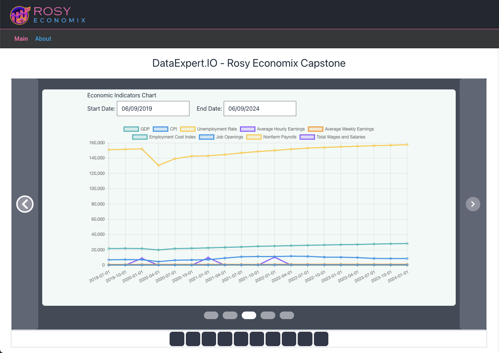
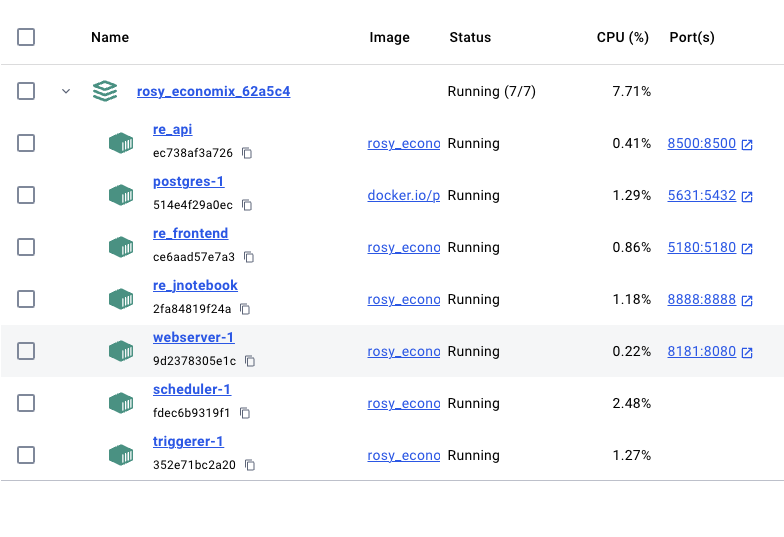

# Rosy Economix - A tool to identify spin

**Table of Contents**


- [Project Proposal](#project-proposal)
  - [Project Overview](#project-overview)
  - [Team](#team)
  - [Objective](#objective)
  - [Background and Motivation](#background-and-motivation)
  - [Explorative Datasets](#explorative-datasets)
- [Project Components](#project-components)
- [Implementation Plan](#implementation-plan)
- [Potential Use Cases](#potential-use-cases)
- [Getting Started](#-getting-started)
  - [Prerequisites](#prerequisites)
  - [Local Development](#local-development)
    - [Debugging](#debugging)
  - [dbt Project Setup](#dbt-project-setup)
- [POC Idea Development](#poc-idea-development)
- [Conclusion](#conclusion)

    
# Project Proposal
A Rosy Economics Investigative Tool


## Capstone Team
- Jesse (Jess) Charbneau - [LinkedIn](https://www.linkedin.com/in/jcharbneau)

### Additional Contributors
- Aleem Rahil - [LinkedIn](https://www.linkedin.com/in/aleemrahil/)

### Objective

To develop an integrated system that retrieves, stores, and analyzes economic and financial data from multiple sources, with the aim of identifying and correlating cause-and-effect relationships between various economic indicators and financial market trends. The system will also overlay significant government interventions, such as changes in interest rates, tax breaks, and currency policies, to provide a comprehensive view of market dynamics. The project will focus on analyzing the impact of federal policies on stock data, along with three main aspects: credit card volume and delinquency analysis, cumulative fact tables, and creating engaging metrics for everyday users/investors.

### Key Features

1. **Data Retrieval:**
   - Automate the retrieval of historical and daily economic data from the Federal Reserve Economic Data (FRED).
   - Retrieve financial data from sources like Yahoo Finance or Alpha Vantage.

2. **Data Storage:**
   - Store the retrieved data in PostgreSQL.
   - Ensure efficient handling and storage of large datasets, with a particular focus on at least one dataset containing over a million rows.

3. **Data Analysis:**
   - Perform advanced data analysis to uncover insights and correlations using statistical methods.
   - Develop cumulative fact tables from stock data and related datasets (stock ticker, company name, industry).

4. **Overlay Government Interventions:**
   - Integrate significant government events and policies to overlay them on economic and financial data visualizations.

5. **Credit Card Volume and Delinquency Analysis:**
   - Analyze credit card volume and delinquency trends using data from FRED or other reliable financial sources.

6. **Engaging Metrics and Visualization:**
   - Create interactive charts and graphs to visualize the impact of federal policies and other economic indicators on financial markets.
   - Develop engaging metrics tailored for everyday users and investors.

7. **Future Integration:**
   - Plan for future integration of technologies like Apache Spark, Flink, and Kafka for real-time data processing, streaming, and enhanced analytical capabilities.
   
8. **ML Opportunities**
   - Options to download quarterly, annual, proxy or 8-k statements; derive insights and compare to market trends or federal policy
   - Comparative analysis between company provided reports and public information and whether there is correlating evidence to company provided information (detect the spin)
   - Comparative analysis between federally provided reports and public & corporate provided information and whether there is correlating evidence to company provided information (detect the spin)
   
## Background and Motivation

Understanding the interplay between economic indicators and financial markets is crucial for making informed decisions in finance, economics, and policy-making. Traditional methods of data analysis often lack the ability to dynamically update and process large volumes of data in real-time. Additionally, government interventions can significantly impact market dynamics. This project aims to bridge these gaps by leveraging modern data processing technologies to create a robust, scalable, and real-time capable system.

As part of this effort, we anticipate making a decision about which datasets would be most useful by May 31st including identification of the pipelines we intend to incorporate and what insights they will provide in determining economic indicators and correlative impact.
### Explorative Datasets
**Federal Reserve Datasets**
<pre><code>jess@jess-mac-dev ~/Documents/development/learning/dataengineer.io/bootcamp4/rosy_economics_capstone/project_notes/sample_datasets => python lookup_fred_description.py 
File: PAYEMS.csv -> Dataset Name: All Employees, Total Nonfarm
File: JTSJOL.csv -> Dataset Name: Job Openings: Total Nonfarm
File: WILL5000PR.csv -> Dataset Name: Wilshire 5000 Price Index
File: MSPUS.csv -> Dataset Name: Median Sales Price of Houses Sold for the United States
File: MORTGAGE15US.csv -> Dataset Name: 15-Year Fixed Rate Mortgage Average in the United States
File: GS10.csv -> Dataset Name: Market Yield on U.S. Treasury Securities at 10-Year Constant Maturity, Quoted on an Investment Basis
File: DRCCLACBS.csv -> Dataset Name: Delinquency Rate on Credit Card Loans, All Commercial Banks
File: LNS13023621.csv -> Dataset Name: Unemployment Level - Job Losers
File: MORTGAGE30US.csv -> Dataset Name: 30-Year Fixed Rate Mortgage Average in the United States
Error retrieving data for stock_data_last_35_years: Bad Request.  Invalid value for variable series_id.  Series IDs should be 25 or less alphanumeric characters.
File: stock_data_last_35_years.csv -> Dataset Name: Not Found
File: CPILFESL.csv -> Dataset Name: Consumer Price Index for All Urban Consumers: All Items Less Food and Energy in U.S. City Average
File: REVOLSL.csv -> Dataset Name: Revolving Consumer Credit Owned and Securitized
File: UNRATE.csv -> Dataset Name: Unemployment Rate
File: ICSA.csv -> Dataset Name: Initial Claims
File: NONREVSL.csv -> Dataset Name: Nonrevolving Consumer Credit Owned and Securitized
File: DRSFRMACBS.csv -> Dataset Name: Delinquency Rate on Single-Family Residential Mortgages, Booked in Domestic Offices, All Commercial Banks
File: CPIAUCSL.csv -> Dataset Name: Consumer Price Index for All Urban Consumers: All Items in U.S. City Average
File: FEDFUNDS.csv -> Dataset Name: Federal Funds Effective Rate
File: HSN1F.csv -> Dataset Name: New One Family Houses Sold: United States
File: EFFR.csv -> Dataset Name: Effective Federal Funds Rate
File: FYFSD.csv -> Dataset Name: Federal Surplus or Deficit [-]
File: RSXFS.csv -> Dataset Name: Advance Retail Sales: Retail Trade
File: GDP.csv -> Dataset Name: Gross Domestic Product
File: TOTALSL.csv -> Dataset Name: Total Consumer Credit Owned and Securitized
jess@jess-mac-dev ~/Documents/development/learning/dataengineer.io/bootcamp4/rosy_economics_capstone/project_notes/sample_datasets =>
</code>
</pre>

**Stock Data**

In order to meet the objective of having at least one dataset that is over 1m rows, we are exploring options using Yahoo Finance to get the last 35 years of data on a large swath of companies, including those from the Technology, Energy, Retail and other industries.  Our test dataset is 1.3m rows, and includes the following stock ticker -> companies. 
The file is 30+mb gzipped, so we have opted to provide a facility to download it.  If unable to use this project, a downloaded copy has been placed at https://www.jessecharbneau.com/downloads/stock_data_last_35_years.csv.gz.  We are also considering options to identify which vertical or industry a company belongs to, in order to classify and then identify trends around the economic indicators and if there is correlative data to show which industries are more affected by interventions and/or large economic impacts.

<pre><code>jess@jess-mac-dev ~/Documents/development/learning/dataengineer.io/bootcamp4/rosy_economics_capstone/project_notes/sample_datasets => python lookup_stock_company.py 
Stock Ticker | Company Name                           | Industry
--------------------------------------------------------------------------------
AAPL         | Apple Inc.                               | Consumer Electronics
MSFT         | Microsoft Corporation                    | Software - Infrastructure
IBM          | International Business Machines Corporation | Information Technology Services
GE           | General Electric Company                 | Aerospace & Defense
KO           | The Coca-Cola Company                    | Beverages - Non-Alcoholic
JNJ          | Johnson & Johnson                        | Drug Manufacturers - General
XOM          | Exxon Mobil Corporation                  | Oil & Gas Integrated
PG           | The Procter & Gamble Company             | Household & Personal Products
MCD          | McDonald's Corporation                   | Restaurants
WMT          | Walmart Inc.                             | Discount Stores
T            | AT&T Inc.                                | Telecom Services
MRK          | Merck & Co., Inc.                        | Drug Manufacturers - General
PFE          | Pfizer Inc.                              | Drug Manufacturers - General
CVX          | Chevron Corporation                      | Oil & Gas Integrated
BA           | The Boeing Company                       | Aerospace & Defense
PEP          | PepsiCo, Inc.                            | Beverages - Non-Alcoholic
VZ           | Verizon Communications Inc.              | Telecom Services
V            | Visa Inc.                                | Credit Services
CSCO         | Cisco Systems, Inc.                      | Communication Equipment
INTC         | Intel Corporation                        | Semiconductors
WBA          | Walgreens Boots Alliance, Inc.           | Pharmaceutical Retailers
NKE          | NIKE, Inc.                               | Footwear & Accessories
DIS          | The Walt Disney Company                  | Entertainment
MMM          | 3M Company                               | Conglomerates
OKE          | ONEOK, Inc.                              | Oil & Gas Midstream
EPD          | Enterprise Products Partners L.P.        | Oil & Gas Midstream
ET           | Energy Transfer LP                       | Oil & Gas Midstream
MPLX         | MPLX LP                                  | Oil & Gas Midstream
PAA          | Plains All American Pipeline, L.P.       | Oil & Gas Midstream
....
....
jess@jess-mac-dev ~/Documents/development/learning/dataengineer.io/bootcamp4/rosy_economics_capstone/project_notes/sample_datasets => 
</code></pre>
## Architecture Diagrams

### Development


## Project Components

1. **Data Retrieval**
    - **FRED API:** Fetch historical and daily updates for macroeconomic indicators such as GDP, inflation rates, employment rates, etc.
    - **Yahoo Finance API:** Retrieve historical and daily updates for financial market data such as stock prices (e.g., S&P 500), interest rates, and exchange rates.
      - Sector Representation

        1.	Technology: AAPL, MSFT, IBM, CSCO, INTC, NVDA, ADBE, QCOM, AVGO, TXN, AMD, INTU, AMAT, MU, LRCX, KLAC, HPQ, DELL
        2.	Consumer Discretionary: MCD, NKE, SBUX, GM, F, TSLA, HD, TGT, LOW, JBLU, SWA
        3.	Consumer Staples: KO, PG, PEP, WMT, WBA, MO, COST
        4.	Healthcare: JNJ, MRK, PFE, AMGN, MDT, GILD, BMY, DHR
        5.	Financials: V, GS, AXP
        6.	Energy: XOM, CVX, PXD, EOG, HAL, SLB, BKR, DVN, COP, OXY, APA, FANG, HES, MRO, MTDR, PSX, VLO, MPC, DK, BP, E, ENB, TRP, KMI, WMB, OKE, EPD, ET, MPLX, PAA
        7.	Industrials: GE, BA, MMM, HON, CAT, RTX, LMT, FDX, UPS, CSX, UNP, NSC, UAL, DAL, AAL, LUV, IDA
        8.	Utilities: XEL, NEE, DUK, SO, AEP, D, EXC, PEG, PCG, EIX, PPL, FE, ED, NRG, AES, CMS, DTE, ETR, AEE, WEC, ES, ATO, NI, CNP, PNW, OGE
        9.	Communication Services: T, VZ, CMCSA, DIS, NFLX
        10.	Real Estate: PLD, AMT, SPG
        11.	Materials: ALB, LIN, SHW, APD

    - **Intraday Stock Prices:** Fetch hourly stock prices for major indices or stocks to ensure a large dataset.
    - **Credit Card Data:** Retrieve data on credit card volume and delinquency rates from FRED or Alpha Vantage.

2. **Data Storage**
    - **Postgres:** As this is not a huge amount of data, and in the interest of time; we have decided to use PostgreSQL + Docker.
    - **Apache Airflow:** Automate the data retrieval and storage processes using Airflow DAGs to ensure data is updated daily.

3. **Data Analysis**
    - **Correlation Analysis:** Use statistical methods to identify relationships between economic indicators and financial market performance.
    - **Visualization:** Create visualizations to depict these relationships and make insights easily understandable.
    - **Overlay Government Interventions:** Integrate data on government policies and significant events, such as interest rate changes, tax breaks, and currency policies, and overlay them on visualizations to provide context to the data.
    - **Credit Card Analysis:** Analyze credit card volume and delinquency trends and correlate them with other economic indicators.

4. **Future Integration and Enhancements**
    - **Apache Spark:** Incorporate Spark for large-scale data processing and advanced analytics.
    - **Apache Flink:** Utilize Flink for real-time data streaming and processing, enabling near real-time analytics and insights.
    - **Apache Kafka:** Integrate Kafka for reliable and scalable data streaming, ensuring seamless data flow between various components of the system.

## Implementation Plan / Current Status

1. **Phase 1: Initial Setup and Data Retrieval**
    - ✅ Download Fred and Yahoo Finance datasets for Aleem and Anjana to begin review
    - ✅ Set up Apache Airflow, Postgres and Jupyter Docker containers (including compose)
      - Used docker-compose.overrides.yml in conjunction with Astro
    - 🚧 Begin developing DAGs for data retrieval from FRED and Yahoo Finance
      - Yahoo Datasets
        - Daily for the last 35 years to use as a back-fill dataset 
        - Hourly: Note Yahoo Finance allows only the last 7 days for hour by hour data
      - Download identified FRED datasets, on a daily basis
      - Identify strategy to back-fill as much data as possible, going back at least 35 years

2. **Phase 2: Data Analysis and Visualization**
    - 🚧 Implement preprocessing and alignment of data from different sources.
      - Initial build out utilizing python for mass data pull for historical backfill
      - DBT for seeding and subsequent modeling of the data through to Mart level dataset.
    - 🚧 Perform correlation analysis to identify significant relationships.
    - 🚧 Create visualizations to represent the findings.
      - Jupyter notebooks using matplotlib, plotly and ipywidgets
      - React frontend and FastAPI backend included via docker-compose.overrides.yml (basic at this point)
    - ⬜ Integrate and overlay government interventions on the visualizations.
    - ⬜ Implement strategies to analyze credit card volume and delinquency data.


3. **Phase 3: Testing and Deployment**
    - Conduct thorough testing of all components and ensure seamless integration.
    - Deploy the system in a production environment.
    - Monitor and maintain the system, ensuring it runs smoothly and efficiently.

## Potential Use Cases

1. **Real-Time Economic Monitoring:** Continuously monitor and analyze the economic indicators and financial markets to provide real-time insights for economists, policymakers, and financial analysts.
2. **Predictive Analytics:** Use historical data to develop predictive models that forecast future economic and financial trends.
3. **Risk Management:** Help financial institutions and businesses manage risk by understanding the impact of economic changes on financial markets.
4. **Investment Strategies:** Inform investment strategies by identifying correlations between macroeconomic indicators and market performance.
5. **Policy Impact Analysis:** Evaluate the impact of government interventions on the economy and financial markets, providing valuable insights for policy-making.
6. **Credit Card Risk Analysis:** Assess credit card volume and delinquency trends to inform risk management strategies for financial institutions.

# **🚀 Getting Started**

## **Prerequisites**

1. **Install [Docker](https://docs.docker.com/engine/install/)**: Docker is a platform for packaging, distributing, and managing applications in containers.
2. **Install the [Astro CLI](https://docs.astronomer.io/astro/cli/install-cli)**: Astro CLI is a command-line tool designed for working with Apache Airflow projects, streamlining project creation, deployment, and management for smoother development and deployment workflows.

## **Local Development**

1. **Clone the Repository**: Open a terminal, navigate to your desired directory, and clone the repository using:
    ```bash
    git clone git@github.com:DataExpert-ZachWilson-V4/capstone-project-rosy_economix.git # clone the repo
    cd capstone-project-rosy_economix/ # navigate into the new folder
    ```
    
    1. If you don’t have SSH configured with the GitHub CLI, please follow the instructions for [generating a new SSH key](https://docs.github.com/en/authentication/connecting-to-github-with-ssh/generating-a-new-ssh-key-and-adding-it-to-the-ssh-agent) and [adding a new SSH key to your GitHub account](https://docs.github.com/en/authentication/connecting-to-github-with-ssh/adding-a-new-ssh-key-to-your-github-account?tool=cli) in the GitHub docs.
2. **Docker Setup and Management**: Launch Docker Daemon or open the Docker Desktop app
3. **Run the Astro Project**:
   - Start the project on your local machine by running **`astro dev start`**
       - This will spin up 7 Docker containers on your machine, each for a different Airflow component:
           - **Postgres**: Airflow's Metadata Database, storing internal state and configurations.
           - **Webserver**: Renders the Airflow UI.
           - **Scheduler**: Monitors, triggers, and orchestrates task execution for proper sequencing and resource allocation.
           - **Triggerer**: Triggers deferred tasks.
           - **Notebook**: A Jupyter Notebook service for data exploration
           - **Frontend**: A ReactJS+Vite+TailwindCSS environment
           - **API**: A FastAPI backend
       - Verify container creation with **`docker ps`** or **`astro dev ps`**
         - **Access the Airflow UI**: Go to http://localhost:8181/ and log in with '**`admin`**' for both Username and Password
         
          >
          >    ℹ️ Note: Running astro dev start exposes the Airflow Webserver at port **`8181`** and Postgres at port **`5631`**.
          >
          >    If these ports are in use, halt existing Docker containers or modify port configurations in **`.astro/config.yaml`**.  
          >
          >    There are several additional services included in this project.  
          >    - Jupyter Notebooks: http://localhost:8888
          >    - ReactJS Frontend: http://localhost:5180
          >    - FastAPI Backend: http://localhost:8500/docs
          >
          >    ℹ️ This is a customized implementation of Astronomer.
          >
          >    This repository contains a src/docker-compose.override.yml file, that allows us to "override" Astro and inject additional containers into the ecosystem.  There are deficiencies.  A 'astro dev <instance> bash' will still only work for the astro containers.  Use standard docker commands to avoid this challenge.  Review src/docker-compose.overrides.yml for more details. In addition, communication is a little different between the client (us) and the internal services (namely postgres as it runs internally on 5432 while when we connect via a UI it is on 5631). 
          > 
       - You should see something resembling below:

         


4. **Setup the Seed data**
   
   Execute the following statements to create a virtual environment for dbt.  You will need to have a recent version of Python 3 installed for these steps.
   
   <pre><code>cd src/dbt_project
   python3 -m venv .venv
   source .venv/bin/activate
   #
   # if using WSL, you may also need to run these commands:
   # sudo apt install postgresql postgresql-contrib
   # sudo apt-get install libpq-dev python3-dev build-essential
   #
   pip install pip --upgrade
   pip install psycopg2
   pip install -r dbt-requirements.txt
   </code></pre>
   Once these steps have been completed, move on to retrieving the data
   
   <pre><code># execute the stock retrieval script
   python scripts/get_stock_data_last_35years.py
   
   # verify the script wrote the file, and verify the file length 
   #  there should be over 1m rows
   ls -l seeds/raw_stock_data.csv && wc -l seeds/raw_stock_data.csv
   
   # execute the script to get the federal (fred) data
   python scripts/download_fred_data.py
   
   # verify the fred data downloaded 
   ls -l seeds/{gdp,cpi,unemployment_rate}.csv
   wc -l seeds/{gdp,cpi,unemployment_rate}.csv
   </code></pre>
5. **Seed the raw tables & Run the dbt models**
   This step will take the raw data, and create the staging, intermediate and mart tables
   <pre><code># verify dbt is working and configured correctly
   dbt debug
   
   # use dbt to seed the data to the postgresql instance
   dbt seed
   
   # verify the record counts
   # raw stock data
   PGPASSWORD='postgres' psql -U postgres -h localhost -p 5631 -d pipelines -c "SELECT count(*) from public.raw_stock_data;"
   
   # raw cpi data
   PGPASSWORD='postgres' psql -U postgres -h localhost -p 5631 -d pipelines -c "SELECT count(*) from public.cpi;"
   
   # raw gdp data
   PGPASSWORD='postgres' psql -U postgres -h localhost -p 5631 -d pipelines -c "SELECT count(*) from public.gdp;"
   
   # raw unemployment rate data
   PGPASSWORD='postgres' psql -U postgres -h localhost -p 5631 -d pipelines -c "SELECT count(*) from public.unemployment_rate;"
   
   # if everything is sane, execute the models
   dbt run
   </code></pre>
6. **Stop** the Astro Docker container by running `**astro dev stop**`
    >
    > ❗🚫❗  Remember to stop the Astro project after working to prevent issues with Astro and Docker ❗🚫❗
    >

## POC Idea Development

To isolate behavior, we first identified some areas of interest for this project using a conceptual data modeling exercise as discussed in the coursework.

**Conceptual Data Model**


**POC React+ChartJS with FastAPI+Matplotlib for tooling display**

While simplistic, these screenshots illustrate the idea of rapid comparison of various metrics to systemic impacts from Government interventions.


## Conclusion

The Rosy Economix application will provide a powerful tool for understanding and analyzing the complex relationships between economic indicators and financial markets. By leveraging modern data processing technologies such as Apache Spark, Flink, and Kafka, and integrating government intervention data and credit card analysis, the system will be capable of real-time data processing and advanced analytics, offering valuable insights for a wide range of stakeholders.

**Next Steps:**
- Finalize the project plan and gather the necessary resources.
- Initiate Phase 1 with the setup of Airflow, Trino, and S3 Iceberg tables.
- Develop and test the initial data retrieval and storage scripts.

We look forward to embarking on this project and unlocking new insights into the economic and financial landscape.

The Economic and Financial Data Analysis System will provide a powerful tool for understanding and analyzing the complex relationships between economic indicators and financial markets. By leveraging modern data processing technologies such as Apache Spark, Flink, and Kafka, and integrating government intervention data and credit card analysis, the system will be capable of real-time data processing and advanced analytics, offering valuable insights for a wide range of stakeholders.

**Next Steps:**
- Finalize the project plan and identify datasets and begin finalizing the data model.
  - Window Based Analysis:
    - Would it be useful to have DoD / WoW / MoM / YoY values for stocks? What about Fed data?
    - Rolling sum / avg?  monthly?  (Thinking trading volumes?) - Where else could we could apply this analysis?
      - 50 day simple moving average (Advanced SQL and Applying Analytic Patterns ~ 49:30 minutes)
    - Ranking?
  - Aggregations
  - Cumulation based
- Complete the build out of the target Compose environment
- Develop and test the initial data retrieval and storage scripts.

We look forward to embarking on this project and unlocking new insights into the economic and financial landscape.


