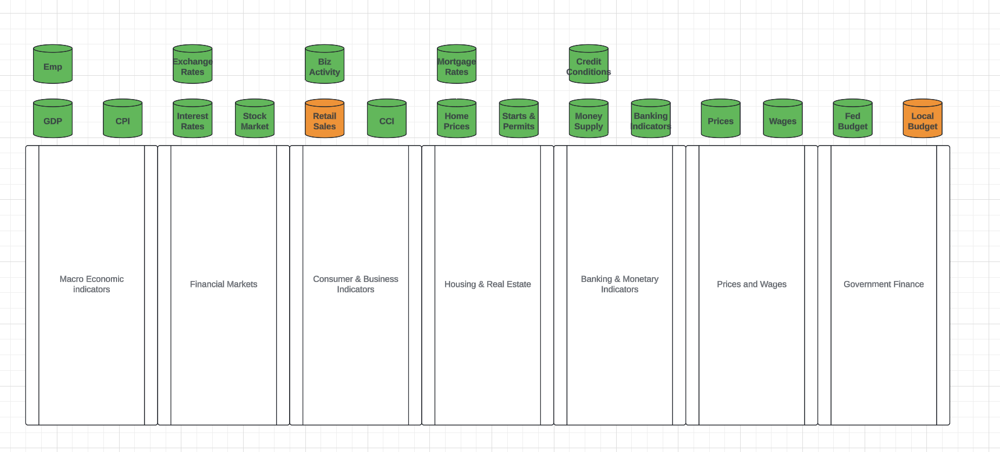
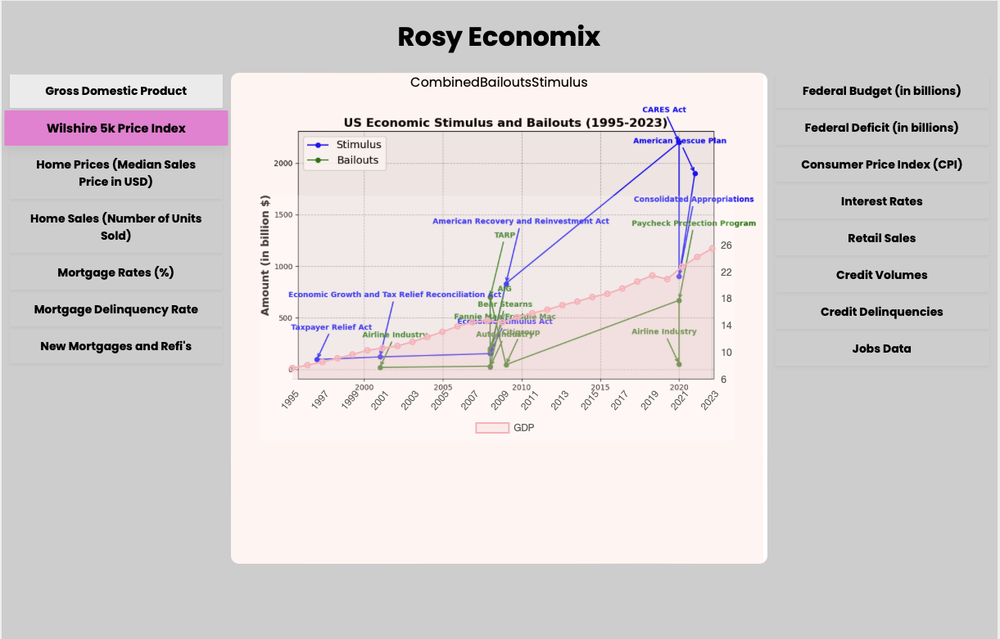
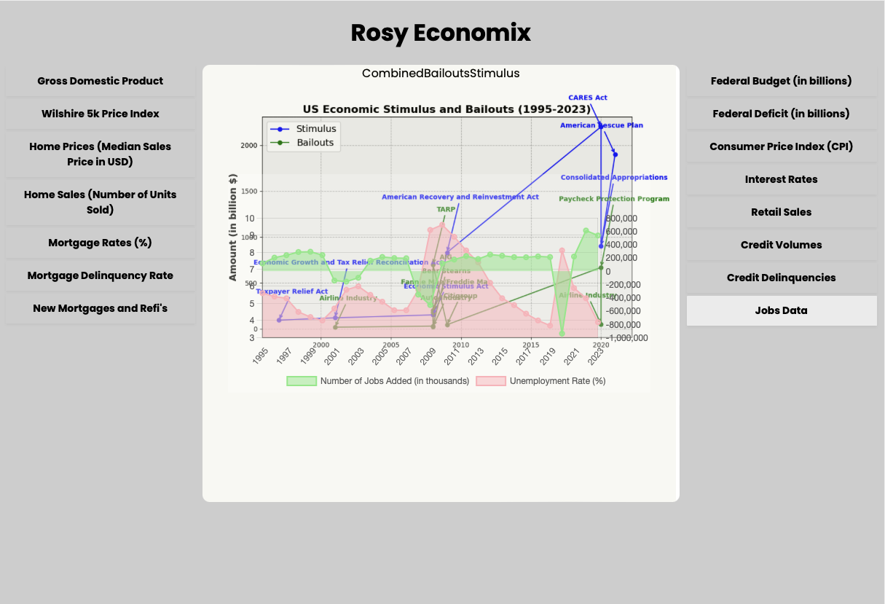

# Project Proposal: Integrated Economic and Financial Data Analysis System

## Project Overview

**Project Name:** Economic and Financial Data Analysis System

**Team**
- Jesse (Jess) Charbneau - https://www.linkedin.com/in/jcharbneau
- Aleem Rahil - https://www.linkedin.com/in/aleemrahil/
- Anjana Shivangi - https://www.linkedin.com/in/anjana-shivangi

**Objective:** To develop an integrated system that retrieves, stores, and analyzes economic and financial data from multiple sources to identify and correlate cause-and-effect relationships between various economic indicators and financial market trends. The system will also overlay significant government interventions, such as changes in interest rates, tax breaks, and currency policies, to provide a comprehensive view of market dynamics.

**Key Features:**
1. **Data Retrieval:** Automate the retrieval of historical and daily economic data from the Federal Reserve Economic Data (FRED) and financial data from Alpha Vantage.
2. **Data Storage:** Store the retrieved data in Trino tables backed by S3 Iceberg tables for efficient and scalable storage.
3. **Data Analysis:** Perform advanced data analysis to uncover insights and correlations using statistical methods.
4. **Overlay Government Interventions:** Integrate significant government events and policies to overlay them on economic and financial data visualizations.
5. **Credit Card Volume and Delinquency Analysis:** Incorporate strategies to analyze credit card volume and delinquency using data from FRED or Alpha Vantage.
6. **Large Dataset Integration:** Ensure at least one dataset has a large footprint (over a million rows) to meet final exam targets.
7. **Future Integration:** Incorporate Apache Spark, Flink, and Kafka for real-time data processing, streaming, and enhanced analytical capabilities.

## Background and Motivation

Understanding the interplay between economic indicators and financial markets is crucial for making informed decisions in finance, economics, and policy-making. Traditional methods of data analysis often lack the ability to dynamically update and process large volumes of data in real-time. Additionally, government interventions can significantly impact market dynamics. This project aims to bridge these gaps by leveraging modern data processing technologies to create a robust, scalable, and real-time capable system.

As part of this effort, we anticipate making a decision about which datasets could be completed by end of capstone, the pipelines we intend to incorporate and what insights they can provide.
### Explorative Datasets
**Federal Reserve Datasets**
<pre><code>
jess@jess-mac-dev ~/Documents/development/learning/dataengineer.io/bootcamp4/rosy_economics_capstone/project_notes/sample_datasets => python lookup_fred_description.py 
File: PAYEMS.csv -> Dataset Name: All Employees, Total Nonfarm
File: JTSJOL.csv -> Dataset Name: Job Openings: Total Nonfarm
File: WILL5000PR.csv -> Dataset Name: Wilshire 5000 Price Index
File: MSPUS.csv -> Dataset Name: Median Sales Price of Houses Sold for the United States
File: MORTGAGE15US.csv -> Dataset Name: 15-Year Fixed Rate Mortgage Average in the United States
File: GS10.csv -> Dataset Name: Market Yield on U.S. Treasury Securities at 10-Year Constant Maturity, Quoted on an Investment Basis
File: DRCCLACBS.csv -> Dataset Name: Delinquency Rate on Credit Card Loans, All Commercial Banks
File: LNS13023621.csv -> Dataset Name: Unemployment Level - Job Losers
File: MORTGAGE30US.csv -> Dataset Name: 30-Year Fixed Rate Mortgage Average in the United States
Error retrieving data for stock_data_last_35_years: Bad Request.  Invalid value for variable series_id.  Series IDs should be 25 or less alphanumeric characters.
File: stock_data_last_35_years.csv -> Dataset Name: Not Found
File: CPILFESL.csv -> Dataset Name: Consumer Price Index for All Urban Consumers: All Items Less Food and Energy in U.S. City Average
File: REVOLSL.csv -> Dataset Name: Revolving Consumer Credit Owned and Securitized
File: UNRATE.csv -> Dataset Name: Unemployment Rate
File: ICSA.csv -> Dataset Name: Initial Claims
File: NONREVSL.csv -> Dataset Name: Nonrevolving Consumer Credit Owned and Securitized
File: DRSFRMACBS.csv -> Dataset Name: Delinquency Rate on Single-Family Residential Mortgages, Booked in Domestic Offices, All Commercial Banks
File: CPIAUCSL.csv -> Dataset Name: Consumer Price Index for All Urban Consumers: All Items in U.S. City Average
File: FEDFUNDS.csv -> Dataset Name: Federal Funds Effective Rate
File: HSN1F.csv -> Dataset Name: New One Family Houses Sold: United States
File: EFFR.csv -> Dataset Name: Effective Federal Funds Rate
File: FYFSD.csv -> Dataset Name: Federal Surplus or Deficit [-]
File: RSXFS.csv -> Dataset Name: Advance Retail Sales: Retail Trade
File: GDP.csv -> Dataset Name: Gross Domestic Product
File: TOTALSL.csv -> Dataset Name: Total Consumer Credit Owned and Securitized
jess@jess-mac-dev ~/Documents/development/learning/dataengineer.io/bootcamp4/rosy_economics_capstone/project_notes/sample_datasets => 

</code>
</pre>

**Stock Data**

In order to meet the objective of having at least one dataset that is over 1m rows, we are exploring options using Yahoo Finance to get the last 35 years of data on a large swath of companies, including those from the Technology, Energy, Retail and other industries.  Our test dataset is 1.3m rows, and includes the following stock ticket companies. 
The file is 30+mb gzipped, so we have opted to provide a facility to download it.  If unable to use this project, a downloaded copy has been placed at https://www.jessecharbneau.com/downloads/stock_data_last_35_years.csv.gz.  We are also considering options to identify which vertical or industry a company belongs to, in order to classify and then identify trends around the economic indicators and if there is correlative data to show which industries are more affected by interventions and/or large economic impacts.

<pre><code>
jess@jess-mac-dev ~/Documents/development/learning/dataengineer.io/bootcamp4/rosy_economics_capstone/project_notes/sample_datasets => python lookup_stock_company.py 
Stock Ticker | Company Name
--------------------------------------------------
AAPL         | Apple Inc.
MSFT         | Microsoft Corporation
IBM          | International Business Machines Corporation
GE           | General Electric Company
KO           | The Coca-Cola Company
JNJ          | Johnson & Johnson
XOM          | Exxon Mobil Corporation
PG           | The Procter & Gamble Company
MCD          | McDonald's Corporation
WMT          | Walmart Inc.
T            | AT&T Inc.
MRK          | Merck & Co., Inc.
PFE          | Pfizer Inc.
CVX          | Chevron Corporation
BA           | The Boeing Company
PEP          | PepsiCo, Inc.
VZ           | Verizon Communications Inc.
V            | Visa Inc.
CSCO         | Cisco Systems, Inc.
INTC         | Intel Corporation
WBA          | Walgreens Boots Alliance, Inc.
NKE          | NIKE, Inc.
DIS          | The Walt Disney Company
MMM          | 3M Company
HON          | Honeywell International Inc.
AMGN         | Amgen Inc.
CAT          | Caterpillar Inc.
RTX          | RTX Corporation
GS           | The Goldman Sachs Group, Inc.
AXP          | American Express Company
LMT          | Lockheed Martin Corporation
MO           | Altria Group, Inc.
CMCSA        | Comcast Corporation
DHR          | Danaher Corporation
ORCL         | Oracle Corporation
MDT          | Medtronic plc
GILD         | Gilead Sciences, Inc.
BMY          | Bristol-Myers Squibb Company
COST         | Costco Wholesale Corporation
TGT          | Target Corporation
LOW          | Lowe's Companies, Inc.
HD           | The Home Depot, Inc.
SBUX         | Starbucks Corporation
FDX          | FedEx Corporation
UPS          | United Parcel Service, Inc.
GM           | General Motors Company
F            | Ford Motor Company
TSLA         | Tesla, Inc.
NFLX         | Netflix, Inc.
NVDA         | NVIDIA Corporation
ADBE         | Adobe Inc.
QCOM         | QUALCOMM Incorporated
AVGO         | Broadcom Inc.
TXN          | Texas Instruments Incorporated
AMD          | Advanced Micro Devices, Inc.
INTU         | Intuit Inc.
AMAT         | Applied Materials, Inc.
MU           | Micron Technology, Inc.
LRCX         | Lam Research Corporation
KLAC         | KLA Corporation
HPQ          | HP Inc.
DELL         | Dell Technologies Inc.
CSX          | CSX Corporation
UNP          | Union Pacific Corporation
NSC          | Norfolk Southern Corporation
KSU          | N/A
UAL          | United Airlines Holdings, Inc.
DAL          | Delta Air Lines, Inc.
AAL          | American Airlines Group Inc.
LUV          | Southwest Airlines Co.
JBLU         | JetBlue Airways Corporation
SWA          | N/A
XEL          | Xcel Energy Inc.
NEE          | NextEra Energy, Inc.
DUK          | Duke Energy Corporation
SO           | The Southern Company
AEP          | American Electric Power Company, Inc.
D            | Dominion Energy, Inc.
EXC          | Exelon Corporation
PEG          | Public Service Enterprise Group Incorporated
PCG          | PG&E Corporation
EIX          | Edison International
PPL          | PPL Corporation
FE           | FirstEnergy Corp.
ED           | Consolidated Edison, Inc.
NRG          | NRG Energy, Inc.
AES          | The AES Corporation
CMS          | CMS Energy Corporation
DTE          | DTE Energy Company
ETR          | Entergy Corporation
AEE          | Ameren Corporation
WEC          | WEC Energy Group, Inc.
ES           | Eversource Energy
ATO          | Atmos Energy Corporation
NI           | NiSource Inc.
CNP          | CenterPoint Energy, Inc.
PNW          | Pinnacle West Capital Corporation
OGE          | OGE Energy Corp.
IDA          | IDACORP, Inc.
ALB          | Albemarle Corporation
PXD          | Pioneer Natural Resources Company
EOG          | EOG Resources, Inc.
HAL          | Halliburton Company
SLB          | Schlumberger Limited
BKR          | Baker Hughes Company
DVN          | Devon Energy Corporation
COP          | ConocoPhillips
XEC          | N/A
OXY          | Occidental Petroleum Corporation
APA          | APA Corporation
FANG         | Diamondback Energy, Inc.
HES          | Hess Corporation
MRO          | Marathon Oil Corporation
CLR          | N/A
CXO          | N/A
MTDR         | Matador Resources Company
PSX          | Phillips 66
VLO          | Valero Energy Corporation
MPC          | Marathon Petroleum Corporation
HFC          | N/A
DK           | Delek US Holdings, Inc.
BP           | BP p.l.c.
RDS.A        | N/A
RDS.B        | N/A
TOT          | N/A
E            | Eni S.p.A.
ENB          | Enbridge Inc.
TRP          | TC Energy Corporation
KMI          | Kinder Morgan, Inc.
WMB          | The Williams Companies, Inc.
OKE          | ONEOK, Inc.
EPD          | Enterprise Products Partners L.P.
ET           | Energy Transfer LP
MPLX         | MPLX LP
PAA          | Plains All American Pipeline, L.P.
jess@jess-mac-dev ~/Documents/development/learning/dataengineer.io/bootcamp4/rosy_economics_capstone/project_notes/sample_datasets => 

</code></pre>
## Project Components

1. **Data Retrieval**
    - **FRED API:** Fetch historical and daily updates for macroeconomic indicators such as GDP, inflation rates, employment rates, etc.
    - **Alpha Vantage API:** Retrieve historical and daily updates for financial market data such as stock prices (e.g., S&P 500), interest rates, and exchange rates.
    - **Intraday Stock Prices:** Fetch minute-by-minute or hourly stock prices for major indices or stocks to ensure a large dataset.
    - **Credit Card Data:** Retrieve data on credit card volume and delinquency rates from FRED or Alpha Vantage.

2. **Data Storage**
    - **Trino and S3 Iceberg Tables:** Utilize Trino for querying large datasets and S3 Iceberg tables for efficient, scalable storage.
    - **Apache Airflow:** Automate the data retrieval and storage processes using Airflow DAGs to ensure data is updated daily.

3. **Data Analysis**
    - **Correlation Analysis:** Use statistical methods to identify relationships between economic indicators and financial market performance.
    - **Visualization:** Create visualizations to depict these relationships and make insights easily understandable.
    - **Overlay Government Interventions:** Integrate data on government policies and significant events, such as interest rate changes, tax breaks, and currency policies, and overlay them on visualizations to provide context to the data.
    - **Credit Card Analysis:** Analyze credit card volume and delinquency trends and correlate them with other economic indicators.

4. **Future Integration and Enhancements**
    - **Apache Spark:** Incorporate Spark for large-scale data processing and advanced analytics.
    - **Apache Flink:** Utilize Flink for real-time data streaming and processing, enabling near real-time analytics and insights.
    - **Apache Kafka:** Integrate Kafka for reliable and scalable data streaming, ensuring seamless data flow between various components of the system.

## Implementation Plan

1. **Phase 1: Initial Setup and Data Retrieval**
    - Set up Apache Airflow and configure DAGs for data retrieval from FRED and Alpha Vantage.
    - Establish Trino and S3 Iceberg table infrastructure for data storage.
    - Develop and test Python scripts for fetching and storing data.

2. **Phase 2: Data Analysis and Visualization**
    - Implement preprocessing and alignment of data from different sources.
    - Perform correlation analysis to identify significant relationships.
    - Create visualizations to represent the findings.
    - Integrate and overlay government interventions on the visualizations.
    - Implement strategies to analyze credit card volume and delinquency data.

3. **Phase 3: Future Integration with Spark, Flink, and Kafka**
    - Set up Apache Spark for batch processing and advanced analytics.
    - Integrate Apache Flink for real-time data processing and analytics.
    - Utilize Apache Kafka for reliable data streaming between components.

4. **Phase 4: Testing and Deployment**
    - Conduct thorough testing of all components and ensure seamless integration.
    - Deploy the system in a production environment.
    - Monitor and maintain the system, ensuring it runs smoothly and efficiently.

## Potential Use Cases

1. **Real-Time Economic Monitoring:** Continuously monitor and analyze the economic indicators and financial markets to provide real-time insights for economists, policymakers, and financial analysts.
2. **Predictive Analytics:** Use historical data to develop predictive models that forecast future economic and financial trends.
3. **Risk Management:** Help financial institutions and businesses manage risk by understanding the impact of economic changes on financial markets.
4. **Investment Strategies:** Inform investment strategies by identifying correlations between macroeconomic indicators and market performance.
5. **Policy Impact Analysis:** Evaluate the impact of government interventions on the economy and financial markets, providing valuable insights for policy-making.
6. **Credit Card Risk Analysis:** Assess credit card volume and delinquency trends to inform risk management strategies for financial institutions.

## POC Idea Development

To isolate behavior, we first identified some areas of interest for this project using a conceptual data modeling exercise as discussed in the coursework.

**Conceptual Data Model**

**POC React+ChartJS with FastAPI+Matplotlib for tooling display**

While simplistic, these screenshots illustrate the idea of rapid comparison of various metrics to systemic impacts from Government interventions.

## Conclusion

The Rosy Economix application will provide a powerful tool for understanding and analyzing the complex relationships between economic indicators and financial markets. By leveraging modern data processing technologies such as Apache Spark, Flink, and Kafka, and integrating government intervention data and credit card analysis, the system will be capable of real-time data processing and advanced analytics, offering valuable insights for a wide range of stakeholders.

**Next Steps:**
- Finalize the project plan and gather the necessary resources.
- Initiate Phase 1 with the setup of Airflow, Trino, and S3 Iceberg tables.
- Develop and test the initial data retrieval and storage scripts.

We look forward to embarking on this project and unlocking new insights into the economic and financial landscape.

The Economic and Financial Data Analysis System will provide a powerful tool for understanding and analyzing the complex relationships between economic indicators and financial markets. By leveraging modern data processing technologies such as Apache Spark, Flink, and Kafka, and integrating government intervention data and credit card analysis, the system will be capable of real-time data processing and advanced analytics, offering valuable insights for a wide range of stakeholders.

**Next Steps:**
- Finalize the project plan and gather the necessary resources.
- Initiate Phase 1 with the setup of Airflow, Trino, and S3 Iceberg tables.
- Develop and test the initial data retrieval and storage scripts.

We look forward to embarking on this project and unlocking new insights into the economic and financial landscape.

